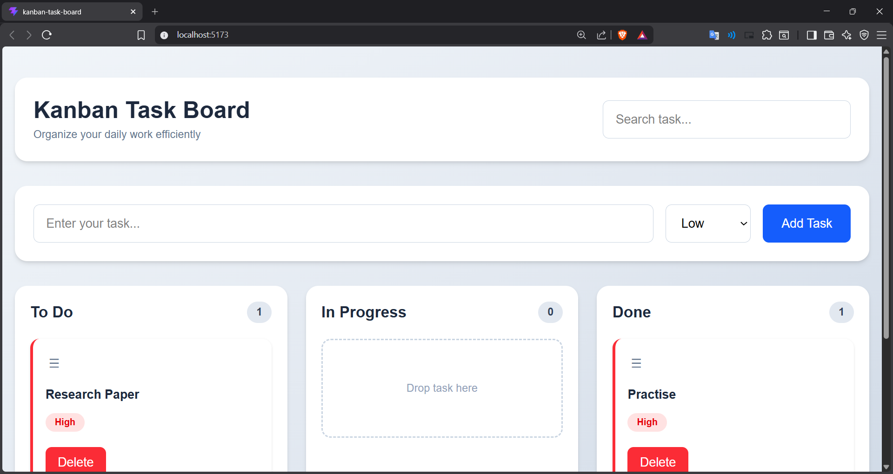

# Kanban Task Board

A responsive Kanban Task Board developed for **Sprint 05** of the Prodesk IT Internship Program.

## Project Overview

This project is a modern task management application inspired by Trello that helps users organize their workflow efficiently.

Users can create tasks, assign priorities, edit task details, search tasks instantly, and manage their workflow by dragging and dropping tasks between different columns.

The application includes:

* Responsive User Interface
* Drag & Drop Task Management
* Three Workflow Columns (To Do, In Progress, Done)
* Inline Task Editing
* Real-time Search Functionality
* Priority-based Task Classification
* Local Storage Persistence
* Modern Card-Based UI

## Technologies Used

* React.js
* Vite
* JavaScript (ES6+)
* Tailwind CSS
* dnd-kit
* Local Storage
* Git & GitHub

## Features

* Create new tasks
* Drag and drop tasks between columns
* Edit task names inline
* Delete tasks
* Search tasks in real time
* Priority levels (High, Medium, Low)
* Automatic data persistence using Local Storage
* Responsive design for desktop and mobile devices

## Screenshot

## Live Demo

https://kanban-task-board-bay.vercel.app/

## GitHub Repository

https://github.com/abhishek-8899/Prodesk-IT-Sprint-5

